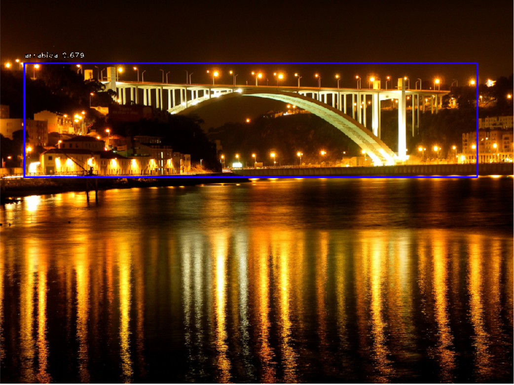
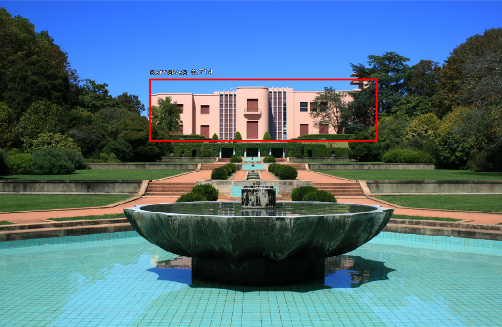

# Project 2 - Porto's Landmarks

This project was developed using the following tools

* PyCharm
* Keras
* RetinaNet
* Google Colab (with GPU, for training the model)

  
  
        
<b>Fig. 1</b> - Ponte da Arrábida

  

  
  
        
<b>Fig. 2</b> - Casa de Serralves

  

